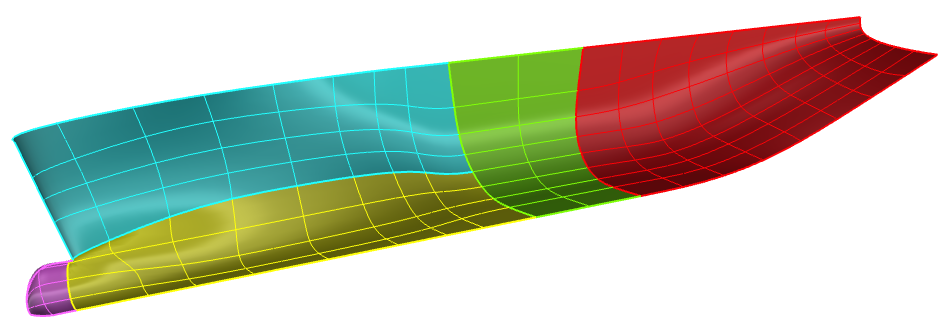
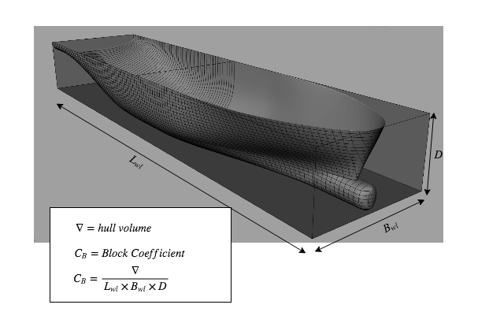
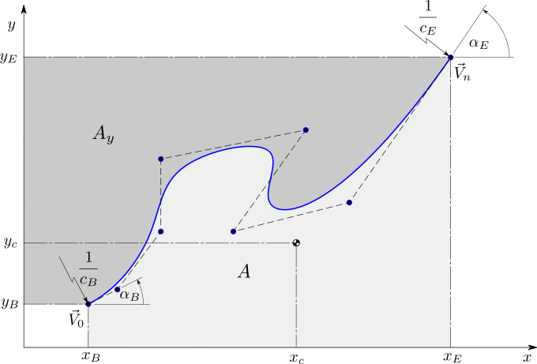
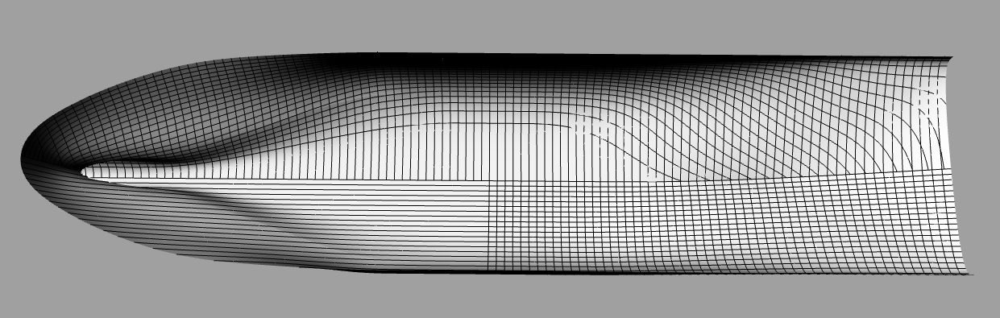

# Relational Lsplines:  Relational logic programming and form parameter design #

## Relational Ship Hull Geometric Design Generation ##

Copyright 2019 Thomas Luke McCulloch

All rights reserved

### What is this repository for? ###

* Quick summary

    *  This package is designed to facilitate feasible form parameter design
       of ship hull curves and surfaces.
       That might sound like a bunch of jargon to some.  Let's start defining things
       and unpack that a bit.

    *  form parameter design:
       Designing geometry by method of optimiztion with constraints.
       I use the method of Lagrange multipliers and my research
       follows work from Horst Nowacki, Stephan Harries, and especially Dr. Lothar Birk,
       my thesis advisor.

    *  feasiblility:
       I mean here that the equations for the design of the geometry have at least
       one solution (defining solution to mean a fixed point under iteration)
       that is reachable from the starting point of an optimization.

    *  relational logic programming:
    This is the combination of logic programming, specifically the unification algorithm,
    with relational programming, here meaning interval relations.
    Okay, there is a lot to unpack here.  First, relational logic programming
    means constraint programming in the sense of Will Byrd, author of miniKanren.
    Data can flow forwards and backwards across a relation.  There may be more than one answer
    to a question.  In this case 'questions' are interval valued rules derived from naval architecture.
    A good bit of what we do here - that is, how the relational computing sytem works,
    (and the names of functions developed in it's implementation) 
    is informed by the sensibilities found in Kanren related langague research.
    But it is filtered through the lens of form parameter design, and especially something
    called 'interval arithemetic' (and interval analysis, though the full power of intervals 
    hasn't made it into this version.  Not even close.)

    *  interval arithmetic:
    Intervals are a type for doing math, much like integers and floats, but extended in `space.'
    That is to say, intervals are, naturally enough, continuous segments - intervals of the reals, from a minimum,
    or infimum, to a max, or supremum.  A basic interval has no gaps.  It is similar to a simply connected set.
    Obviously then, I, being an engineer, am not qualified to teach them precisely.
    Consult your local mathematician for definitionsn that are just so.
    However, as an engineer, I've included an interval class in my code because I found them useful.
    When combined with miniKanren style relational ``steam'' (aka list) based (multivalued) computing, I like to think that
    some special things happen.

    *  Interval arithmetic + set based relational logic programming (like miniKanren) is special and cool:
    One of the amazing things about interval methods for filtering a design space is that they
    give sensible answers even when 0 is included in the divisor interval.
    Jumping way ahead here, intervals can sense singularities in a design space.
    The way intervals naturally handle singular division, that is, division by an interval containing zero,
    is to split the resulting interval into two halves, one positive and one negative.
    Thanks to the fact that we are in a design space, we are not troubled by the positive and negative infinities
    which bound our two intervals resuilting from the split.
    Long story short, intervals can still conduct meaningful design space narrowing around a singularity.
    And it is gauranteed to enclose all the valid solutions to the interval division.
    This can be fairly useful for excluding singlular portions of a design space.  (A design space is
    a configuration space for form parameters, to use some more words I particularly like.)
    Anyway, the trouble with interval splitting is that handling the resulting two intervals is tricky.  
    In fact the correct paradigm,
    that I know of, for handling this return of more than one answer from an arithmetic question is
    stream based computing.  (IMplemented as a list of answers or perhaps a lazy varient of this which in Python might use generators)  
    One might return lists of values for a given variable symbol, or lists of states for a given set of rules.
    With this in mind, miniKanren style relational programming becomes the natural model for computation with
    relational intervals.  There is much more 'synergy' between intervals and relational computing, starting with
    interval contractors, especially 'forward backward contractors' for local mathematical consistency enforcement, and
    interval systems solvers for global solution proving, but I want to keep this somewhat short.

    *  What we are doing:
    Is using interval arithmetic (basic math, forward backward contractors, splitting, etc.) together with unification and stream/list based computing to
    filter an initial design space in such a way that a program can search over the space without
    ever having to trouble itself with infeasible designs, nor possibly disjoint spaces, according to the rules we will impose
    which define what that feasibilitiy is.  This is because the intervals naturally infer the feasible domain as data flows
    through the network.  They do this via contractor programming, which is just another way to say relational constraint unification.

    Finally, the part where we define the rules - where we define the feasiblity, comes back to the geometry.
    The rules to be satisfied are just the natural basic relationships coming from our particular engineering domain,
    ship hull design.
    For our purposes so far, a system of rules relating the various dimensions and areas of ship
    hull form curves has proven sufficient to allow the form parameter design algorithms to
    successfully solve for any set of constraints thereby imposed.  Right now, the system attempts to narrow itself down into one design
    before starting the actual curve solvers to generate the hull.  In the future, one could change this up to generate lists of lists
    of self consistent design parameters.  That is, to generate hull designs in parallel.  One could also think of using the
    full power of interval contractor arithmetic to "pave" the design space, a la Luc Jalin, et. al.
    For my part, I keep thinking of wrting some kind of linear solver in relational variables directly.  The idea is to build the most
    powerful global interval machinery out of the most powerful local relational interval machinery.  (Keep your own/off switch for AC_revise handy ;)  
    But this is a major digression
    that will not mean much unless you are alredy familiar with most of these bits and pieces.  Look up "interval newton's method"
    for starters there.  Do note that the code here includes such a beast.  Experiments with interval B-spline curve solving were
    marginally successful.  One thing to do is to attack them again, this time with the full local power of miniKanren included
    for contractor programming and singularity splitting.

    Anyway, just a minute ago I alluded to the fact that we use the rule system for putting the rest of the program on some kind of foundation.
    Since global rules are slow, and local hierarchies are fast, the Form Parameter System takes over from there, first generating a
    basic hull form without details.  (And a ship's bulbous bow is prepared in much the same way, see 'GeometryGenerator.py for those rules')  
    Then the B-spline hull form is cast into a Truncated Hierarchical Basis-Spline representation.  There the bulb and hull are crudely combined,
    and local shaping of the hull takes place - right now and just as a toy example instance, we are enforcing tangential flatness at the nose of the
    bare hull before attaching the bulb.

* Version 0.1
* [A website is under construction here](https://LukeMcCulloch.github.io)
* [Also there is a repository with some more demo code](https://github.com/LukeMcCulloch/Relational-Interval-Geometry)

# So... Why Relational-Interval-Geometry?
There is neat stuff here.  For examples...

# Neat stuff, on the declarative design front:
1. They use declarative constraint programming to generate complex ship hull geometry from a design specification.
2. Numerical constraints are parsed into expression trees and compiled into declarative relational constaints.
3. A network of constraints is automatically built based on freely modified mathematical relations between design variables
4. Interval arithmetic is used to process constraints on the entire design space at once
5. An constraints become interval valued relations between design space parameters.
6. Constraint propagation narrows the design space to the feasible domain based on the latest design choices.
7. The solver is able to narrow the design space down to individual self-consistent design parameter vectors.
8. This is what is needed to ensure that the nonlinear solver, mentioned just below, will be successfull in 
solving for the nice looking geometry.

# So a constraint on the length, width, and height of the hull form ensures that the hull will never exceed those bounds.
## e.g. L*W*H <= 100.0, or what have you.  How does that work, under the hood?
1. It will be processed into a syntax tree:

2. Then compiled into declarative constriant language
3. And constraint propagation over the interval valued design space will eliminate design subspaces which violate the constraint.
4. In the end your ship hull satisfies this and more constraints which form a network

5. And many more constraints bsides.  Finally there is a constraint conforming ship hull.

(This picture above is an actual result of the program, design generated from an input vector, randomly selected from portions of the design space deamed feasible by the constraint solver.  Another example is given below.)

# Neat stuff, on the automatic differentiation, nonlinear shape optimization front:
2. There is an automatic differentiation implementation of a nonlinear constraint solver based on Lagrange's method of multiplies.
3. This is coupled with an AD variables representation of B-spline control points
4. There is also a full B-spline library so that any quantity of a B-spline curve or surface can be automatically 
differentiated.
5. The code uses this to automatically generate the systems of equations needed for Lagrange multiplier based optimization.
6. Once the solve is complete, the geometry meets the constraints exactly and is smooth according to some energy norms.
7. TODO: insert pictures here!  (ship shapes)

# Actual ship hulls look something like this:

(This picture above is an actual result of the program, design generated from an input vector, randomly selected from portions of the design space deamed feasible by the constraint solver.  As you can see we are looking up at the ship hull from down below it.)

# Neat stuff, on the multiresolution modeling portion:
1. The solver above is nice, but we would also like to vary detail locally, without needlessly adding control points elsewhere.
2. The code uses the truncated hierarchical basis splines to make this work.
3. TODO: insert pictures here!  (the elegant THB basis, or maybe some local shape detail)

### How do I get set up? ###

* Summary of set up
    *  Pull the code here:
    git clone https://github.com/LukeMcCulloch/feasible-form-parameter-design
    *  Assuming dependencies are met (see below), go to the top level directory (where setup.py is found)
    and run
    > pip install .

    to install.
    *  Or
    > pip install . --upgrade
    
    to update after making changes.
    *  import relational_lsplines to access the code.

* Configuration - nothing here
* Dependencies
    *  numpy
    *  matplotlib
    *  Python basic stuff.  Nothing that isn't in a stock anaconda distro is required.  Ok, I know that is an enormous distribution.  
       But seriously, if there is something weird/hard to get required, I will do my best to take it out.  
       I am shooting for just requiring Numpy and Matplotlib.  Fancy graph plotting will be optional until it becomes dead simple to
       install.
    *  One thing required in the present version:  intervals from the pyinterval package [here.](https://github.com/taschini/pyinterval) 
       If you use pip, get with pip install pyinterval

* Database configuration
* How to run 'tests'  (how to make your cpu spin random numbers into something resembling a ship hull form)
    *  Currently automated tests are down.
    *  The file
    test_hull_generation.py
    contains a simple usage example of the primary automatic geometry generation functionality - including adding a THBspline bulb.
    *  The file
    simple_hull_rules_langague.py
    also contains a simple usage example of the primary automatic geometry generation functionality - including adding a THBspline bulb.
    Do note that some performance tweaking and experimentation has been ongoing with the search tree used here, which actually lives in...
    *  The file
    opt_simple.py
    This cryptically named file (which in original form stood for hull_optimization - now 'simple'-ified) now contains a walled garden menuing system for
    driving many of the main features of the hull form generation program.  Simply run this file in source to see the program.
    Or import the package, get to this file, create an instance of the 'ShipDesigner' class, and call ShipDesigner() on the class instance.
    perhaps I'll give it call method to startup, but really I am vastly far behind on my writing so maybe later?..

* Deployment instructions
    *  import relational_lsplines to access the code.
    *  everything is still in a 'research state' at the moment I am afraid, though some attempt has been made to improve access.  See above.

### Example Code ###
Jupyter notebooks examples and other things...

* Do the following:
    *  Go to source/Jupyter and run first_notebook.ipyb
    *  This is to help get started.  Eventually (of course) the idea is to "document and test everything."
* If feeling adventurous, try the "quick_hull" notebook.  It actually "runs everything" (autonomously) and generates a
full on ship hull form from random form parameters.  Unfortunately I still need to look up how to
add interactivity to plots in a Jupyter notebook.  You should get 3D images of the hull at the end, (of 5 minutes or so of runtime) but you can not zoom in and rotate around to see what you've got!

Pure Python external usage of the lib:
* I'm making a new repo demoing the code here:
https://github.com/LukeMcCulloch/Relational-Interval-Geometry.git

Old stuff:

* jupyter notebooks were be accesable here: ##[first_notebook.ipynb](https://nbviewer.jupyter.org/urls/https://TLMbot@bitbucket.org/TLMbot/relational_lsplines/relational_lsplines/first_notebook.ipynb)    
* But this seems to always requires some shennanigans on bitbucket.  Not going to try to hard for this on github as it's not going to give any ROI as far as I can tell.

### Overly complicated stuff, aka how to generate and see hull forms in Rhino using my workflow which has not been properly cleaned up:

    * Run simple_hull_rules_language3.py
    * At the end run ">>> SD.export('rhino')"
    * Then run ">>> SD.export('designspace')" if you want to save the database
    * Then run ComplexHull.py and it will send the geometry to Rhino compatible files 
         by running this command: "ch.export_rhino_surfaces()"
    * Next open Rhino, the B-spline CAD program, and Atom, the hackable text editor for the 21st century, 
        (unlike these instructions --- which are a serious mess)
    * In Rhino type the cmmand:  StartAtomEditorListener' in at the command input window
    * Open InterfaceToRhino.py in Atom (and assuming Atom has installed the Rhinoscript plugin)'
    * run the python file with: ctrl + alt + r'
    * Then the geometry, especially surfaces, but also curves, should pop up in Rhino.
    * That's my present workflow.  Yes I know it could do with a bit of polishing.  One day!

### Contribution guidelines ###

* Writing tests
* Code review
    PEP8, which this code base was 'pretty late to the party' for.
* Other guidelines

### Who do I talk to? ###

* Repo owner or admin
    *  Luke McCulloch here:
    [tlukemcculloch@gmail.com](tlukemcculloch@gmail.com)
* Other community or team contact
